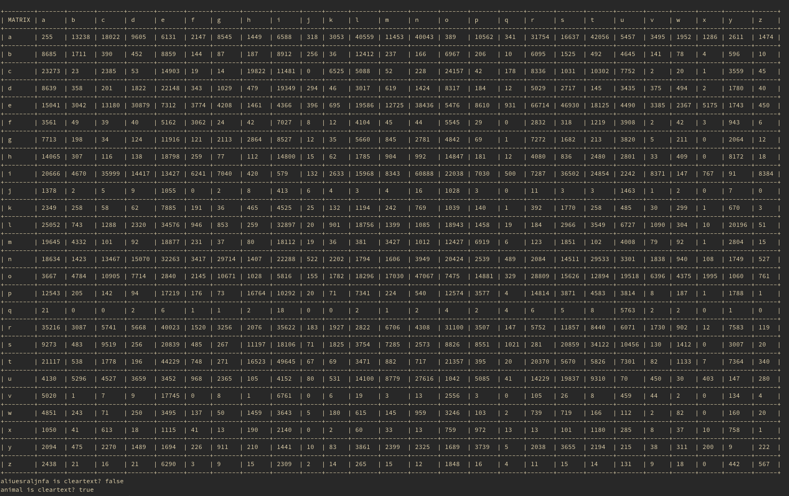

# bigram-analyzer  
Determine if a string is cleartext or not by bigram analysis.  
First you must have a corpus to generate a matrix of bigraph occurrence scores from, then you can test strings against the matrix to guess if it is cleartext or not.  

